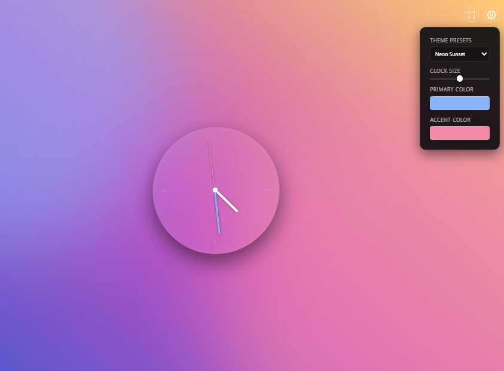
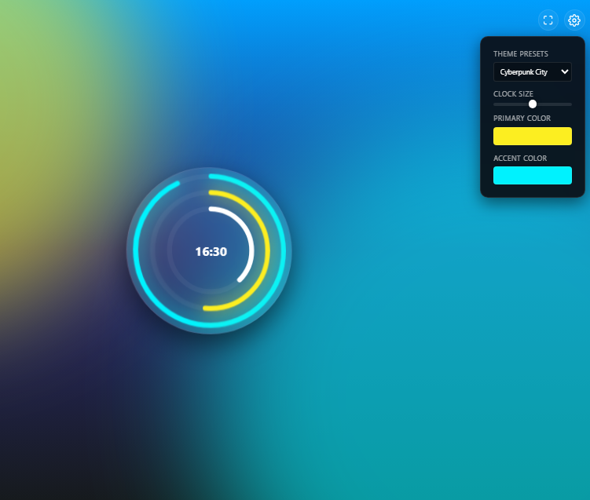
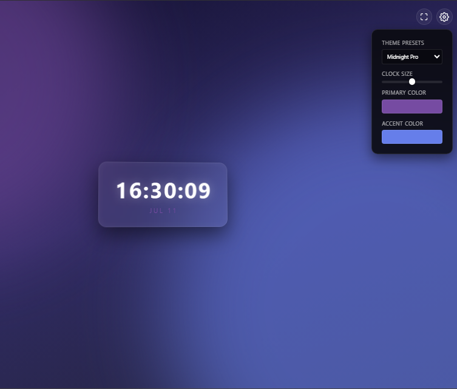

# 🕒 Interactive Clock

A modern and customizable **Analog, Digital Clock UI** built using **HTML, CSS, and JavaScript**.

This project includes interactive features like theme customization, clock size adjustment, and dynamic color changing.

---

## ✨ Features

- 🕒 Real-time Analog Clock
- 🎨 Custom Primary & Accent Colors
- 🌈 Theme Presets
- 📏 Adjustable Clock Size
- 📱 Fully Responsive Design
- ⚡ JavaScript DOM Manipulation

---

## 🛠️ Technologies Used

- HTML5
- CSS3
- JavaScript

---
# Clone THis Repo
``` 
git clone https://github.com/iamdeveloperrayhan/interactive-clock.git
```
---
## 📸 Preview

- Analog Clock

<p align="center">

</p>

- Line Clock

<p align="center">

</p>

- Digital Clock

<p align="center">

</p>
---

## 🚀 Live Demo
[Click Here to View](https://iamdeveloperrayhan.github.io/Morphing-Glass-Clock/)


---

## 📂 Project Structure

Interactive-Clock/
│
├── index.html
├── style.css
├── script.js
└── README.md
└── image.png

---

## 👨‍💻 Author

**Developer Rayhan**

🐙 GitHub

```text
https://github.com/iamdeveloperrayhan
```


---

⭐ If you like this project, consider giving it a star!

